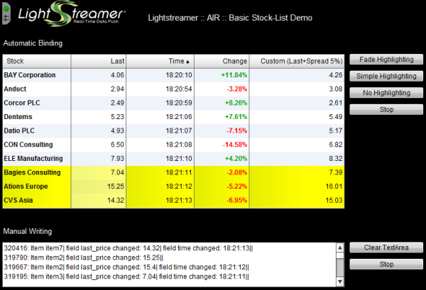

# Lightstreamer - Stock-List Demos - Flex Clients

This project contains simple Flex applications fed through a Lightstreamer connection based on [Lightstreamer StockList Demo Adapter](https://github.com/Weswit/Lightstreamer-example-Stocklist-adapter-java); the demos are written for Flex 4 SDK and one of the the two is ready for deployment as an Adobe AIR application.

## Basic Stock-List Demo - Flex Client

### Live Demo

 
###[ View live demo](http://demos.lightstreamer.com/Flex_StockListDemo) 

### Details

<!-- START DESCRIPTION lightstreamer-example-stocklist-client-flex-basic-stock-list-demo---flex-client -->

This is a Flex version of the [Stock-List Demos](https://github.com/Weswit/Lightstreamer-example-StockList-client-javascript), where ten items are subscribed to. 
This app uses the <b>Flex Client API for Lightstreamer</b> to handle the communications with Lightstreamer Server and uses the <b>Flex DataGrid</b> to display the real-time data pushed by Lightstreamer Server. 
The upper table shows the automatic binding of a Lightstreamer data table to a Flex widget (a DataGrid). You can sort on any columns and drag the columns around. The buttons to the right control the update highlight effects and can stop/start the subscription.

The lower table shows the direct use of pushed values to manually update a Flex widget (a TextArea). The buttons to the right can clear the TextArea and stop/start the subscription.

Tables involved:
* A [VisualTable](http://www.lightstreamer.com/docs/client_flex_asdoc/com/lightstreamer/as_client/VisualTable.html) containing 10 items, subscribed to in <b>MERGE</b> mode, bound to the Flex DataGrid.
* A [NonVisualTable](http://www.lightstreamer.com/docs/client_flex_asdoc/com/lightstreamer/as_client/NonVisualTable.html) containing 10 items, subscribed to in <b>MERGE</b> mode, used to get the events to write into the Flex TextArea.

<!-- END DESCRIPTION lightstreamer-example-stocklist-client-flex-basic-stock-list-demo---flex-client -->

### Install 

If you want to install a version of this demo pointing to your local Lightstreamer Server, follow these steps:

* Note that, as prerequisite, the [Lightstreamer - Stock- List Demo - Java Adapter](https://github.com/Weswit/Lightstreamer-example-Stocklist-adapter-java) has to be deployed on your local Lightstreamer Server instance. Please check out that project and follow the installation instructions provided with it.
* Launch Lightstreamer Server.
* Download the `deploy.zip` file that you can find in the [deploy release](https://github.com/Weswit/Lightstreamer-example-StockList-client-flex/releases) of this project and extract the `Flex4_StockListDemo` folder.
* Crate the folders `/pages/demos/[demo_name]` into your Lightstreamer server installation then copy here the contents of the `Flex4_StockListDemo` folder.
* Launch the demo.

### Build

To build your own version of `Flex4StockListDemo.swf`, instead of using the one provided in the deploy.zip file from the Install section above, the `Flex4_StockListDemo` folder of this project includes the following sub-folders:

* `/src` 
  Contains the sources to build the Flex application. The code of demo is based on Flex 4 SDK.

* `/lib` 
  Should contain the Lightstreamer library to be used for the build process. 
  Please, download the [latest Lightstreamer distribution](http://www.lightstreamer.com/download) and copy the Lightstreamer_as_client.swc file from the Lightstreamer Flex Client SDK (that is located under the `/DOCS-SDKs/sdk_client_flex/lib` folder) into this folder of the project.

#### Deploy

The `Flex4_StockListDemo/deploy` folder contains a deployment image of the demo, which includes a container page and other web resources. You have to complete this with the built Flex application `Flex4StockListDemo.swf` and the `swfobject.js` version 2.2 file from [SWFObject 2](http://code.google.com/p/swfobject/downloads/list).

This deployment image is ready to be deployed under Lightstreamer's internal Web Server, by copying all the contents into the `pages` directory. 

By the current configuration, the demo tries to access Lightstreamer Server by using the protocol, hostname and port from which the `index.html` page was requested; in other words, the demo assumes that the static resources are deployed inside Lightstreamer Server. 
In order to deploy the demo static resources on an external Web Server, some changes are needed on the deployment image before or after copying it into the Web Server folders.
The configuration of the hostname and port (and maybe the protocol) to be used to access Lightstreamer Server should be changed. The configuration lines can be easily found at the beginning of the `index.html` file and can be modified manually, without the need for a recompilation. 
Then, in order to allow the page to get resources from a different server, the Web Server address has to be included in the `/crossdomain.xml` file deployed under Lightstreamer Server.
See the <flex_crossdomain_enabled> element in the Server configuration file for details.

Anyway the [QUOTE_ADAPTER](https://github.com/Weswit/Lightstreamer-example-Stocklist-adapter-java) and [LiteralBasedProvider](https://github.com/Weswit/Lightstreamer-example-ReusableMetadata-adapter-java) have to be deployed in your local Lightstreamer server instance. The factory configuration of Lightstreamer server already provides this adapter deployed. 
The demos are now ready to be launched.

## Basic Stock-List Demo - Flex (AIR) Client
<!-- START DESCRIPTION lightstreamer-example-stocklist-client-flex-basic-stock-list-demo---flex-air-client -->

 
[Click here to download and install the application](http://demos.lightstreamer.com/AIR_StockListDemo/LightstreamerAIRDemoFlex4.air). 

This is the AIR version of the [Flex Demo](https://github.com/Weswit/Lightstreamer-example-StockList-client-flex#basic-stock-list-demo---flex-client).

<!-- END DESCRIPTION lightstreamer-example-stocklist-client-flex-basic-stock-list-demo---flex-air-client -->

## Build ##

If you want to skip the build process of this demo please note that in the [deploy release](https://github.com/Weswit/Lightstreamer-example-StockList-client-flex/releases) of this project you can find the "deploy.zip" file that contains the AIR package, ready to be installed. 

Otherwise, in order to proceed with the build process of this demo, the "AIR4_StockListDemo" folder of this project includes the following sub-folders:

* /src 
  Contains the sources to build the AIR application. The code is based on Flex 4 SDK.

* /lib 
  Should contain the Lightstreamer library to be used for the build process. 
  Please, download the [latest Lightstreamer distribution](http://www.lightstreamer.com/download) and copy the Lightstreamer_as_client.swc file from the Lightstreamer Flex Client SDK (that is located under the /DOCS-SDKs/sdk_client_flex/lib folder) into this folder of the project.

## Deploy ##

In order to install and run the AIR application, the [Adobe AIR runtime](http://get.adobe.com/air/) is required. 

By the current configuration, specified in "AIR4StockListDemo.mxml" and used in the provided AIR package, the demo tries to connect to the demo server currently running on Lightstreamer website.
The demo can be reconfigured and recompiled in order to connect to the local installation of Lightstreamer Server. The host name, the port number, the Adapter Set names and the Data Adapter names should all be changed in the source code.

# See Also #

## Lightstreamer Adapters Needed by These Demo Clients ##
<!-- START RELATED_ENTRIES -->

* [Lightstreamer - Stock- List Demo - Java Adapter](https://github.com/Weswit/Lightstreamer-example-Stocklist-adapter-java)
* [Lightstreamer - Reusable Metadata Adapters- Java Adapter](https://github.com/Weswit/Lightstreamer-example-ReusableMetadata-adapter-java)

<!-- END RELATED_ENTRIES -->

## Related Projects ##

* [Lightstreamer - Stock-List Demos - HTML Clients](https://github.com/Weswit/Lightstreamer-example-Stocklist-client-javascript)
* [Lightstreamer - Basic Stock-List Demo - jQuery (jqGrid) Client](https://github.com/Weswit/Lightstreamer-example-StockList-client-jquery)
* [Lightstreamer - Stock-List Demo - Dojo Toolkit Client](https://github.com/Weswit/Lightstreamer-example-StockList-client-dojo)
* [Lightstreamer - Basic Stock-List Demo - Java SE (Swing) Client](https://github.com/Weswit/Lightstreamer-example-StockList-client-java)
* [Lightstreamer - Basic Stock-List Demo - .NET Client](https://github.com/Weswit/Lightstreamer-example-StockList-client-dotnet)
* [Lightstreamer - Stock-List Demos - Flex Clients](https://github.com/Weswit/Lightstreamer-example-StockList-client-flex)

# Lightstreamer Compatibility Notes #

- Compatible with Lightstreamer Flex client API version 2.1 or newer.
- For Lightstreamer Allegro (+ Flex Client API support), Presto, Vivace.
